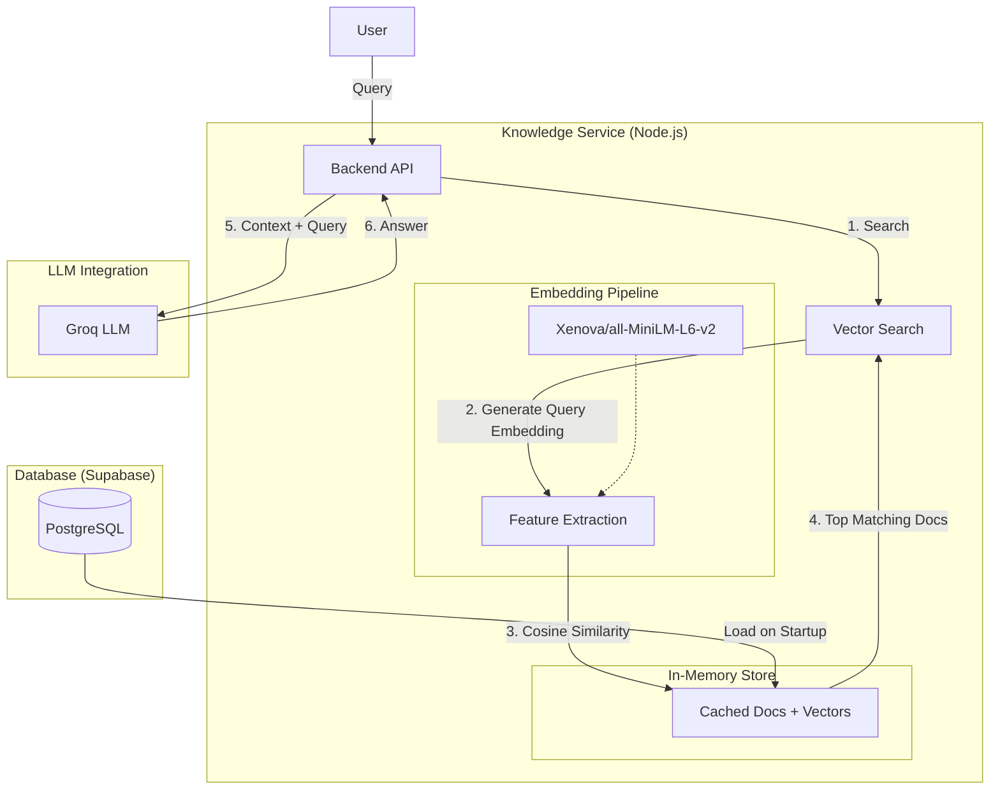

# RAG System Architecture

This document describes the Retrieval Augmented Generation (RAG) architecture implemented for the AI Receptionist.

## Overview
The system uses a **Local In-Memory Vector Search** approach suitable for small-to-medium knowledge bases (up to ~10,000 documents). It runs entirely within the Node.js backend without requiring an external Vector Database (like Pinecone or Weaviate) or external Embedding APIs (like OpenAI), making it **cost-free and low-latency**.

---

## Architecture Diagram

## detailed Components

### 1. Embedding Model
*   **Model**: `Xenova/all-MiniLM-L6-v2`
*   **Implementation**: Runs locally using `@xenova/transformers` (ONNX Runtime).
*   **Dimensions**: 384-dimensional dense vectors.
*   **Performance**: ~10-50ms per embedding on standard CPUs.

### 2. Storage Strategy
*   **Persistent Storage**:
    *   Database: PostgreSQL (via Prisma).
    *   Table: `knowledge_docs`
    *   Column: `embedding` (Stored as `JSON` array, compliant with free-tier DBs).
*   **Runtime Storage**:
    *   On startup, the `KnowledgeService` fetches all active documents.
    *   Documents and their embeddings are cached in **RAM** (In-Memory Array).
    *   This eliminates database latency during search and allows for extremely fast similarity calculations.

### 3. Retrieval Process (Vector Search)
1.  **Input**: User asks a question (e.g., "What is the cancellation policy?").
2.  **Query Embedding**: The system converts the question into a 384-d vector.
3.  **Similarity Scan**:
    *   The system calculates the **Cosine Similarity** between the query vector and every cached document vector.
    *   Formula: `(A · B) / (||A|| * ||B||)`
4.  **Ranking**: Documents are sorted by similarity score (descending).
5.  **Filtering**: Only documents with a score > `0.25` are kept to reduce noise.
6.  **Output**: The top 3 most relevant text chunks are selected.

### 4. Generation (RAG)
1.  **Context Injection**: The text content of the retrieved documents is injected into the **System Prompt**.
    *   Format: `[KNOWLEDGE: Title]\nContent...`
2.  **Instruction**: The System Prompt instructs the AI to "Answer based on the RELEVANT KNOWLEDGE BASE INFORMATION".
3.  **Response**: The Groq LLM generates the final natural language answer.

---

## Data Flow (CRUD)

*   **Create/Update**:
    1.  Admin saves a document.
    2.  Backend generates variable `embedding` for the new content immediately.
    3.  Doc + Embedding saved to Postgres.
    4.  In-memory cache is refreshed.
*   **Read (Search)**:
    1.  User query comes in.
    2.  Search happens against RAM cache (Zero DB hits).

## Advantages of This Approach
*   **Zero Cost**: No recurring fees for vector DBs or embedding APIs.
*   **Privacy**: Embeddings are generated locally; data never leaves your server until the final LLM call.
*   **Simplicity**: Single-container deployment; no complex infrastructure.
*   **Speed**: In-memory search is faster than network calls to an external vector DB.
